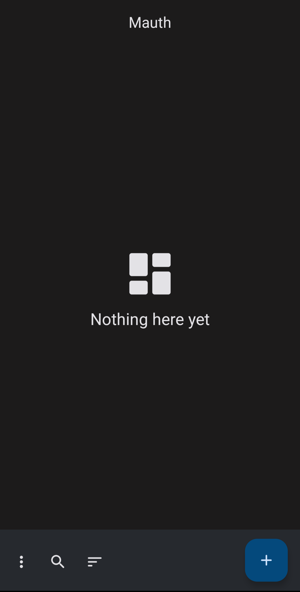

# Mauth

[](https://github.com/X1nto/Mauth/actions/workflows/build.yaml?query=branch%3Amaster)

Mauth (pronounced Moth) is a Two-Factor Authentication app with support for TOTP and HOTP (coming soon) and compatibility with Google Authenticator (coming soon).

Logo by @wingio

# Inspiration
While there are many 2FA authenticator apps out there, most of them come with an outdated UI/UX and functionality. Mauth aims to be as intuitive and feature-rich as possible, while also providing a beautiful Material You UI.

# Features
Note: features marked with `^` are incomplete, while those marked as `!` are currently unavailable, as the app is still in an active development.

- FOSS
- Compatible with Google Authenticator^
- Secure
    - Biometrics!
    - Password!
- Ways to add your accounts
    - QR Code scanning!
    - Manual entering of the details^
- Algorithms
    - TOTP^
    - HOTP!
- Organization
    - Search
        - By name!
        - By label!
        - By issuer!
    - Sorting
        - By label!
        - By label reverse!
        - By issuer!
        - By issuer reverse!
    - Grouping
        - By category!
        - By category reverse!
    - Editing
       - Label!
       - Secret!
       - Icon!
- Export/Import
    - Exporting
        - Plain text!
        - Encrypted data!
    - Importing
        - Google Authenticator!
        - Authy!
        - Aegis!
        - Microsoft Authenticator!

# Screenshots


# License
```
Mauth is free software: you can redistribute it and/or modify
it under the terms of the GNU General Public License as published by
the Free Software Foundation, either version 3 of the License, or
(at your option) any later version.

This program is distributed in the hope that it will be useful,
but WITHOUT ANY WARRANTY; without even the implied warranty of
MERCHANTABILITY or FITNESS FOR A PARTICULAR PURPOSE.  See the
GNU General Public License for more details.

You should have received a copy of the GNU General Public License
along with this program. If not, see <https://www.gnu.org/licenses/>.
```